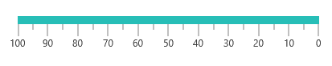

# How-to-change-the-linear-scale-position-in-the-Syncfusion-Xamarin.Forms-SfLinearGauge

This repository contains sample for how to change the linear gauge's scale position in the Xamarin. 

This article explains how to change the linear scale position in the Syncfusion Xamarin.Forms SfLinearGauge control, as shown in below.




## Change the linear gauge position

Scale position can be changed by setting the ScalePosition property to BackWard in SfLinearGauge.

Step1: Create an instance of SfLinearGauge.

Step 2: Added the LinearScale into the scales collection of the linear gauge.

Step 3: Added the ScalePosition property to BackWard value. It is an Enum. It has following values:

| Name  | Description |
| ------------- | ------------- |
| Forward  | Customize the position of the linear scale to forward direction. It is default value.  |
| BackWard  | Customize the position of the linear scale to backward direction  |

[XAML]
```
<gauge:SfLinearGauge>
        <gauge:SfLinearGauge.Scales>
            <gauge:LinearScale ScaleBarColor="#e0e0e0" LabelColor="#424242" MinorTicksPerInterval="1" ScalePosition="BackWard" >
                <gauge:LinearScale.MajorTickSettings>
                    <gauge:LinearTickSettings Thickness="1"  Color="Gray" Length="15"/>
                </gauge:LinearScale.MajorTickSettings>
                <gauge:LinearScale.MinorTickSettings>
                    <gauge:LinearTickSettings Thickness="1"  Color="Gray" Length="7"/>
                </gauge:LinearScale.MinorTickSettings>
                <gauge:LinearScale.Ranges>
                    <gauge:LinearRange StartValue="0" EndValue="100" Color="#27beb7" Offset = "-20"/>
                </gauge:LinearScale.Ranges>
            </gauge:LinearScale>
        </gauge:SfLinearGauge.Scales>
    </gauge:SfLinearGauge>
```

## See also

[How to set the scale in opposite position in Xamarin.Forms SfLinearGauge](https://help.syncfusion.com/xamarin/linear-gauge/scales#setting-opposite-position)

[How to set the corner radius type for scale in Xamarin.Forms SfLinearGauge](https://help.syncfusion.com/xamarin/linear-gauge/scales#setting-corner-radius-type-for-scale)

[How to add multiple scale in Xamarin.Forms SfLinearGauge](https://help.syncfusion.com/xamarin/linear-gauge/scales#multiple-scales)

[How to set the gradient color for scale in Xamarin.Forms SfLinearGauge](https://help.syncfusion.com/xamarin/linear-gauge/scales#setting-gradient-color-for-scale)

[How to customize the ticks in Xamarin.Forms SfLinearGauge](https://help.syncfusion.com/xamarin/linear-gauge/tick-setting)

[How to customize the pointer in Xamarin.Forms SfLinearGauge](https://help.syncfusion.com/xamarin/linear-gauge/pointers)
